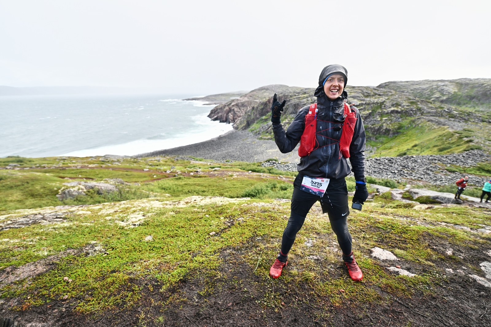
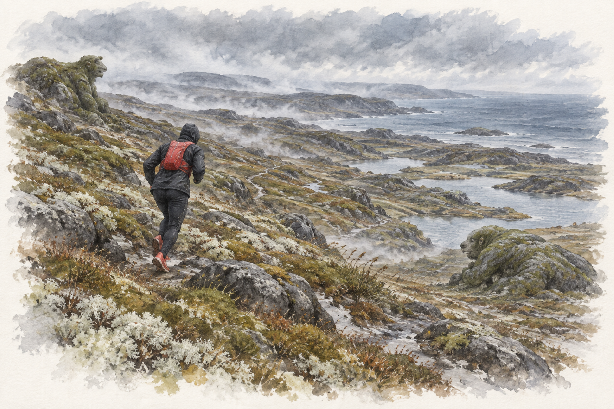
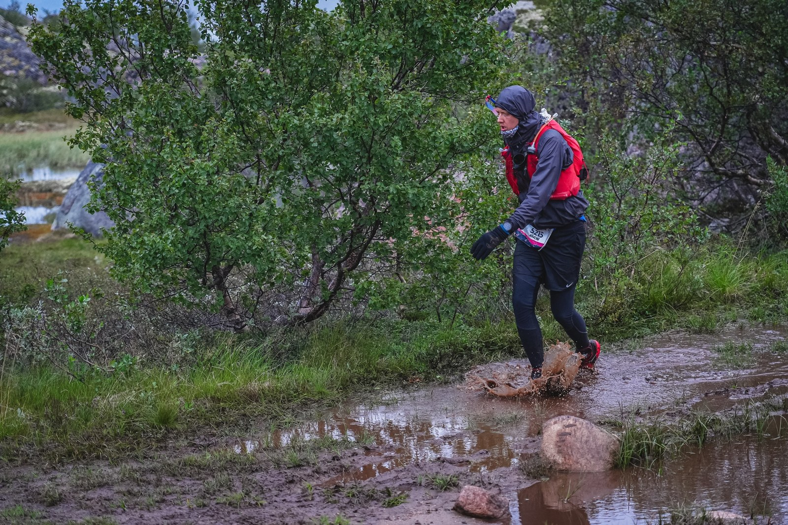
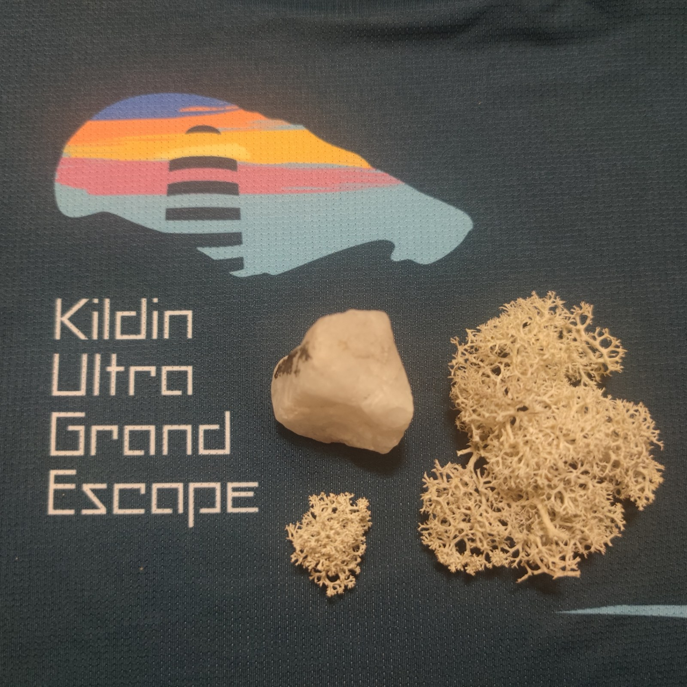

<!--
Исходные записи VK:
- https://vk.ru/wall44829586_610

Вложения исходной записи: оригиналы сохранены локально в media-sources/vk/kildin-ultra/.
- https://vk.ru/photo44829586_457239768
- https://vk.ru/video44829586_456239043
- https://vk.ru/photo44829586_457239769
- https://vk.ru/photo44829586_457239773
- https://vk.ru/photo44829586_457239751
- https://vk.ru/photo44829586_457239703
- https://vk.ru/photo44829586_457239723
- https://vk.ru/photo44829586_457239774
-->

20 августа 2023 год

Мурманск, Kildin Ultra Grand Escape

Running Heroes Russia

Бесконечное Пространство 50, 56,7 км

## DNF, который дороже финиша

tldr: (Моё сообщение из чатика забега)

Уважаемые организаторы, хочу вам заявить, что вы все сумасшедшие и мы все, собравшиеся здесь, такие же сумасшедшие 😄.

Этот забег заставил меня несколько раз потерять и вновь обрести веру в себя. Я хотел сойти уже на 3 км, я мечтал, что меня снимут на ппшках по контрольному времени, но мне удалось дойти до конца, да с опозданием на час, но эта днфка для меня ценнее, чем все финиши на всех предыдущих гонках.

Михаил, Вы говорили, что Кильдин - это сердце стартов RHR, возможно так, но Териберка оказалось самой сутью стартов RHR. Тут были: холод Лисы, болота Совы, горы Невесты, природа Воттоваары, энергия Грута.
Спасибо❤‍🔥

------

## Ласковое дыхание Баренцева моря

А теперь немного деталей.

Ветер, ветер!
На ногах не стоит человек.
Ветер, ветер —
На всем божьем свете!

Самый сложный забег из всех, в которых доводилось участвовать. Ребята после фишина шутили, что не ту гонку называют Вальхаллой, и что в таком аду они ещё не бывали. Это было очень тяжело, но восхитительно.

Забегая вперёд, скажем, что это DNFка, но с медалью. С тяжелой медалью, во всех смыслах.

В Мурманске было тепло, переменная облачность и ласковый ветерок. В добавок на брифинге говорили что "Трасса беговая. Без бродов, максимум пару ручейков по камушкам перейти. Набор есть, но подъемы не сложные. Можете вдоволь нафоткаться и налюбоваться видами, но только не нужно превращать забег в поход".

Поэтому не очень представлялось как именно экипироваться.

## Каждый лишний грамм

Обычно не обращаю внимание на вес рюкзака и беру всё подряд. Как же заблуждался.

В обязательное снаряжение входит аптечка с разными пластырями, бинтами, вазелином и гемостатиком. Воды (полтора литра за спиной, и литр на груди), с запасом гелей, колбасок, немного магния. Фонарик, нож. И, даже, фальшфейер, хотя по фф было не очень понятна необходимость. Они нужны на случай встречи с медведем на острове, но медведи с острова ушли и мы тоже. Где-то в чатиках писали, что места медвежьи и фаер нужен, решил взять, всего каких-то 250 грамм.

Говорили, что на трассе нет мобильной связи и можно брать рации для экстренной связи с ппшками, но на какой частоте будет связь нигде не было написано, поэтому рацию решил оставить, чем выиграл целых 300 грамм.

А вот палки взять было бы полезно, и перед самым выходом, посмотрев на них, решил тоже оставить. Хотя тут спорно, с одной стороны без них на 300 грамм легче, с другой они могли бы помочь на подъемах, но ладно.

3 часа ночи, посадка на автобусы, и около трех часов до Териберки. Поспать толком не удалось, хоть и рубало страшно.

Когда пришли автобусы, стартовый городок ещё только строился, эх бедняги волонтёры, мы хотя бы бежали потом, согревались, а они весь день на этом ветре простояли.

В Териберке погода совершенно противоположная, временами моросящий дождь, холод, но, главное, ветер, ветрище, ветрюганище, ласковое дыхание Баренцева моря.

## Трасса действительно была беговая

9 часов утра, старт, погнали! Первый километр, трасса действительно была беговая, с гладким подъемом, без бродов и всё как на брифинге. А потом началось веселье...

Примерно на третьем километре, засмотревшись окружающимися красотами, пропустил камень и подвернул ногу. Боль — не наступить. Сижу на обочине, кручу и растягиваю сустав, вроде полегчало, немного похрамывая продолжаем путь. Но мысль о том, что трасса не так проста уже появилась.

Первая ппшка, 7 километр, контрольное время 1 час 20 минут. Казалось бы — ерунда, хоть ползком но дойти можно, ведь так? Прибежал к ппшке, с опозданием на 10 минут, но лимиты подвинули на 30 минут. Спросил у волонтеров, какое время и расстояние до следующей ппшки и побежал дальше.

Времени, казалось, было сверхдостаточно. Но с каждым шагом мысль сойти становилась всё более осязаемой. Рюкзак, вопреки закону сохранения массы, становился всё тяжелее, каждый лишний грамм ощущался всем телом. К середине дистанции с радостью готов был быть съеденным медведем, лишь бы не тащить этот тяжеленный фаер.



По записи часов — 56,72 км и 2680 м набора. Время по карточке результата — 11:45:06.

## Лестница в небо

Около 22 километра идет развилка, тридцатка — домой, мы — за приключениями. Сфотографировать забыл, но она выглядит как выбор между:
- AC/DC Highway to hell, вниз по дороге, налево, на финиш сдавшись.
- Led Zeppelin - Stairway To Heaven, вверх, карабкаясь по отвесной стене, но продолжая бороться.

Девиз серии стартов RHR, #nevergiveup, и, хоть с учётом сложности трассы времени до контрольной точки дойти уже почти не оставалось, решил не сдаваться, и продолжить путь, а там, пускай снимают на ппшке, хотя бы дойти.

Вверх, вверх, тяжело, ужасно. Но невероятно красиво, природа, словно находишься на другой планете. Кругом пустота, только мхи, лишайники и болота в горах. В Крыму воды мало, и эти бесконечные просторы выглядят невероятно. Вода повсюду, в каждой ямке, на каждой приступке, будто бы тут, на севере, сама земля состоит из воды. С вершины открываются виды на тысячи озёр, разных по величине, расположенных на разных горизонтах, захватывающе. Складывается ощущение, что есть даже какие-то гравитационные аномалии или не нормальные (не по нормали) горизонты, когда болото расположено на наклонном склоне и при этом не утекает с него.

## Дойти хотя бы до пункта

Время до закрытия ппшки заканчивалось быстрее, чем расстояние. Порой становилось так трудно и плохо, что приходилось ложиться отдохнуть. Такой выматывающий трейл. Где-то на 30 км, нашел в кармане забытую бутылочку гутара, бахнул, чуть потупил и вдруг словно ожил, мир стал цветным, дождь тёплым, ветер утих, в следующий подъем вошел как по ровной дорожке. Вообще на ультре в первую очередь устают не мышцы, а нервная система, всё в голове, тело может значительно больше, чем о нём думает мозг. Поэтому энергетик может вырвать из оцепенения усталости, но эффект оказался не очень продолжителен, забежав на вершину горы, упал там от бессилия. Полежать, отдохнуть, и дальше в путь.

Когда до ппшки оставалось около двух километров, было понятно, что уже не успеваю к закрытию, да к тому же опять накрыло. Присел устроить пикничок, хоть так много за раз и не рекомендуется, но съел три геля вприкуску с колбасками. Появились силы.

Вот до ппшки уже рукой подать, позади парень бежит, и кричит мне, подбадривая что время закрытия сдвинули, ещё 20 минут есть, успеем. Ок, отлично, тогда вперёд.

К 39 километру выпил 1.6 литра из гидратора за спиной, и 0.5 литра из нагрудной бутылки. А поскольку на первой ппшке только спрашивал у волонтеров о времени, то получился автономный почти-марафон.

Залил 0.5 литра изотоника, съел сало и хлеб. Настроение улучшилось и дальше по скалам карабкаться. Вверх, вниз, вверх, вниз, в болото. Долго ли, коротко ли, но часы показывают уже за 50 километров, и трасса приходит к самой дороге на Териберку. Ух, кажется всё, мучения завершены, по асфальтику и на финиш. Но, волонтер показывает налево, наверх, и говорит, что до финиша ещё 6 километров. Аааа, отчаяние и боль, силы совсем уходят, но делать нечего, вперед. Время закрытия финиша стремительно приближается. Опять накрывает, уже совсем плохо, даже начало вести из стороны в сторону. Очень плохо, даже мучительно.

Вверх, вверх, вверх. Радуга. Вверх, вверх, вверх. Ветер. Вверх, вверх, вверх. Болота.

Болото оказалось цепкое, обе ноги одновременно встряли, выше колена, достаешь одну ногу, пока достаешь вторую, опять вязнет первая. Но выбрался. Пока выкарабкивался из болота, меня нагоняет атлет, с которым мы от развилки тридцатки, то и дело шли вместе, то обгоняли друг друга. У него в этот момент сводит левую ногу. Хорошо что у меня всегда есть запасной магний;).

И вот снова открывается вид на стартово-финишный городок, только спуститься с горы и можно за гречечкой. Но трек уходит в сторону. Уже просто нет сил дальше идти и больше всего угнетают петли туда-сюда. Спускаемся с горы. Дорога. Ура, Асфальт? И опять нет, опять в гору, по песку.

## Медаль и северный букет

Но ладно, вот он финиш. Михаил даёт пятюню и подбадривает, вперёд, вперёд. Ворота, финишировал.

Итого 57 км, и 2680 метров набора высоты, за 11 часов 45 минут.

Опоздание на 45 минут, даже не подхожу к девчонкам за медалью, т.к. понимаю, что DNFка, и не поспоришь. Но медаль вручают, говорят что всё равно, даже с учётом прошедшего лимита, медали выдаются. Удивительно, но приятно. Ведь эта DNFка важнее многих финишей. Не сдался и дошел до конца. #newergiveup

Вместо букета полевых цветов с маршрута принес северный букет: клочок белого мха и белый каменный "цветок".

Если на CrazyOwl50 всю силу из меня выкачала "Страна Гремлинов", где около 10 км было пути по "ледяным" болотам глубиной от щиколотки, до колена и выше. То тут "Страна Гремлинов" была в той или иной степени на протяжении всей трассы. Конечно, сам виноват, и если бы лучше тренировался, то можно было бы успеть в лимиты. Но будет хорошим уроком и ценным опытом.

После финиша, придя в тёплую раздевалку меня вновь накрыло. Темно в глазах, головокружение, тошнота, потеря ориентации. Сижу, туплю. Атлет рядом спрашивает, всё ли ок. Говорю, что вот повело, но вроде держусь. Он говорит, что это сахар упал. Он давно упасть мог, но организм на адреналине держался, а когда сел в тёплом помещении, успокоился и поплыл. За время гонки гели дают энергию, но этого может не хватать, нужно срочно поесть.

Съел сникерс. Отдуплился. Собрался. Поел гречки. Сел в автобус. Два с небольшим часа. Мурманск.

13.01'/км — Этот темп, у нас бегом зовётся.


