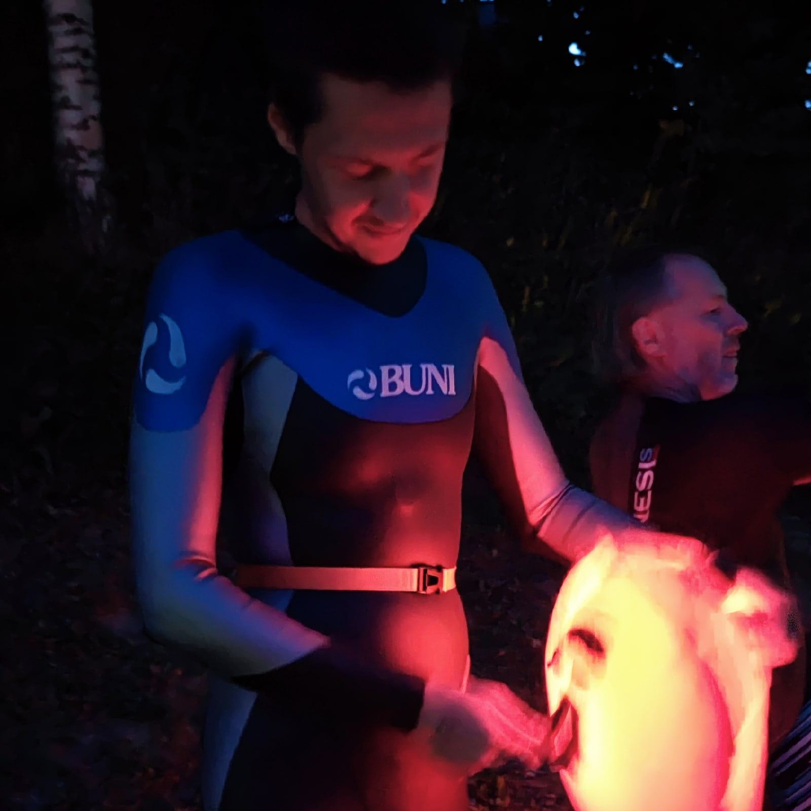
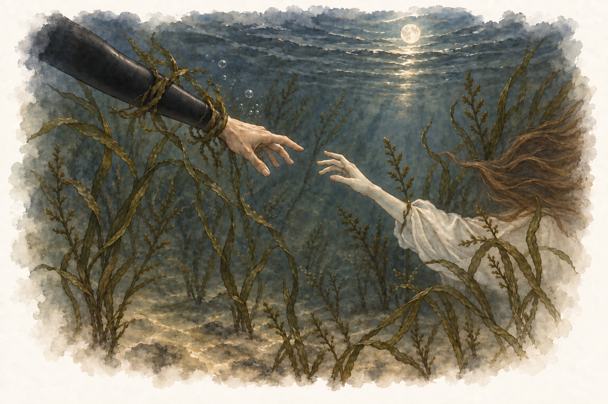

<!--
Редакторские заметки:
- Выполнена лёгкая вычитка, подобраны два снимка из исходной записи.
- Написание залива Аунеланлахти оставлено по авторскому тексту; независимо не подтверждено.
- Автор подтвердил: «маршал сапер» — маршал на сапборде.
- Дата события и название BUNI NIGHT SWIM подтверждены:
  https://www.sports.ru/health/1111119651-na-ozere-xepoyarvi-proshel-unikalnyj-zaplyv-buni-night-swim.html
- Дата записи 23.09.2022 сохранена по VK; событие — 12.08.2022.

Исходные записи VK:
- https://vk.ru/wall44829586_583

Вложения исходной записи (фотографии скачаны по ссылкам из архива VK):
- https://vk.ru/photo44829586_457239380 → glowing-buoy.jpg
- https://vk.ru/photo44829586_457239381 → moon-swim.jpg
- https://vk.ru/photo44829586_457239382 — скриншот Suunto, пока не включён
-->

12 августа 2022 года.

Залив Аунеланлахти озера Хепоярви. BUNI Ночной заплыв.

Одной лишь магии природы достаточно было бы для прекрасного вечера. Но тут ещё и такая удача — заплыв. Необычный, да что там необычный — фантастический, чарующий, таинственный, неповторимый, сказочный вечер.

Вы лишь представьте себе. Едва только солнце скрылось за кромками деревьев, уходящих на запад, ввысь по склону, и на озёрную гладь спустилась тьма, на противоположном берегу залилась заря: громадный оранжево-красный лик луны восставал из-за тёмного леса. По озеру протянулась лунная дорога… И сотня огоньков под россыпью брызг, словно упавшие звёзды, бросилась в воду, устремляясь навстречу восходящей луне.

А звёзды, вы спросите, звёзды? На незашумлённом небе, вдали от городской суеты, рассыпались мириады пылинок звёзд далёких миров — и редкие всполохи метеоров.

И плывёшь в этом озере, среди светящихся буёв. Жаль лишь то, что очки затемнённые: в них хорошо в солнечный день, а в лунную ночь не видно ни зги, только отдельные огни.

Поворотных буёв не различить на фоне страховочных: все одинаково оранжевые и одинаково низко над водой. Видя яркий белый свет, гребу прямо на него и ничего больше не вижу. Подплываю почти впритык — оказывается, это не буй, а маршал на сапборде, который кричит мне, что не туда плыву. Ну, пришлось поворачивать.

Разочек прошёлся почти по краю озера. Так мелко, что руки касаются дна, а водоросли хватают, обвиваясь вокруг рук и ног, словно русалки из гоголевской «Майской ночи». Вода теплющая, можно было брать короткий костюм, но побоялся: мало ли чего ожидать от питерской ночи.

Удивительный заплыв. Всё хорошо, кроме транспортной доступности, хотя бывает и хуже. Пока ехали на заплыв, удалось простоять в пробке. Вдумайтесь только — в пробке на выезде из платной дороги. Маловато там полос и ворот.

А после заплыва, на обратном пути, всё боялись, что не успеем и будет как в песне про ночь и сказочный сон, там, где мосты развели. Хоть это и не так критично: можно объехать вокруг. Ладно. И на следующий год уже тоже зарегистрировались.

А узнал о заплыве не менее странно: по пути на ГРУТ, стоя в непробиваемой пробке из-за ремонта дороги в Покрове, листал ВКонтакте. Заметил новость о заплыве — и сразу зарегистрировался.
