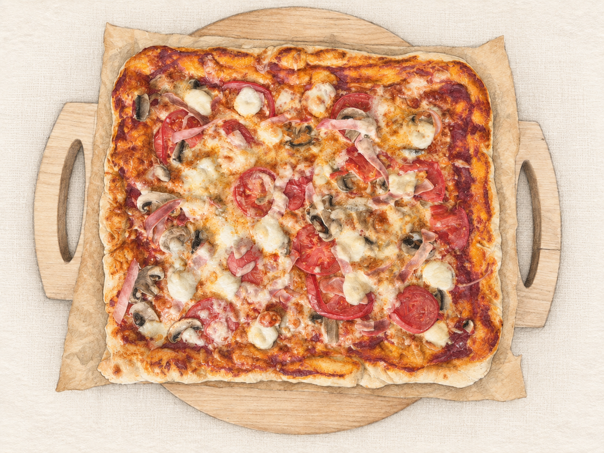
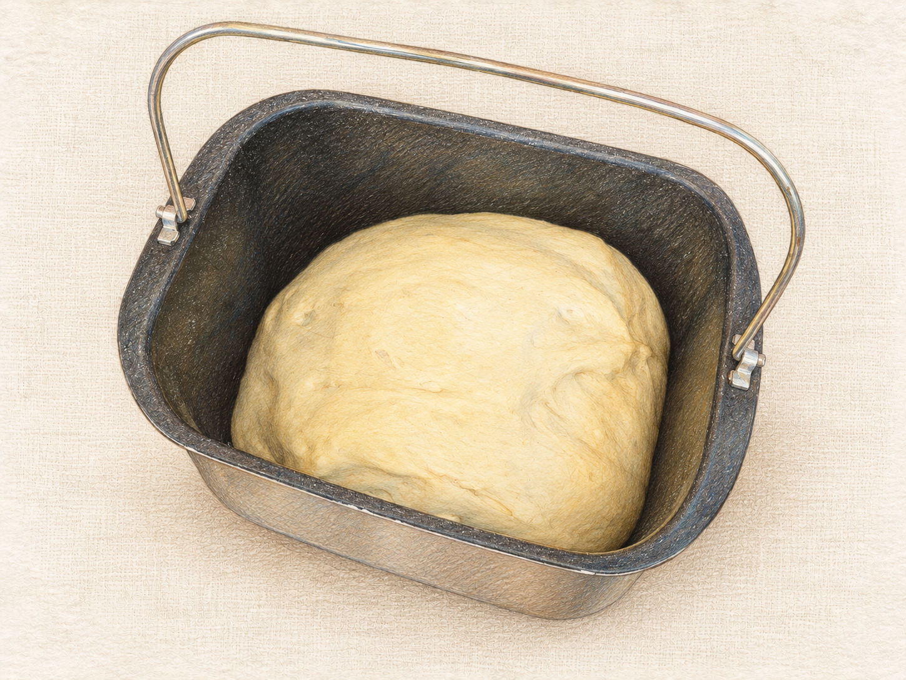
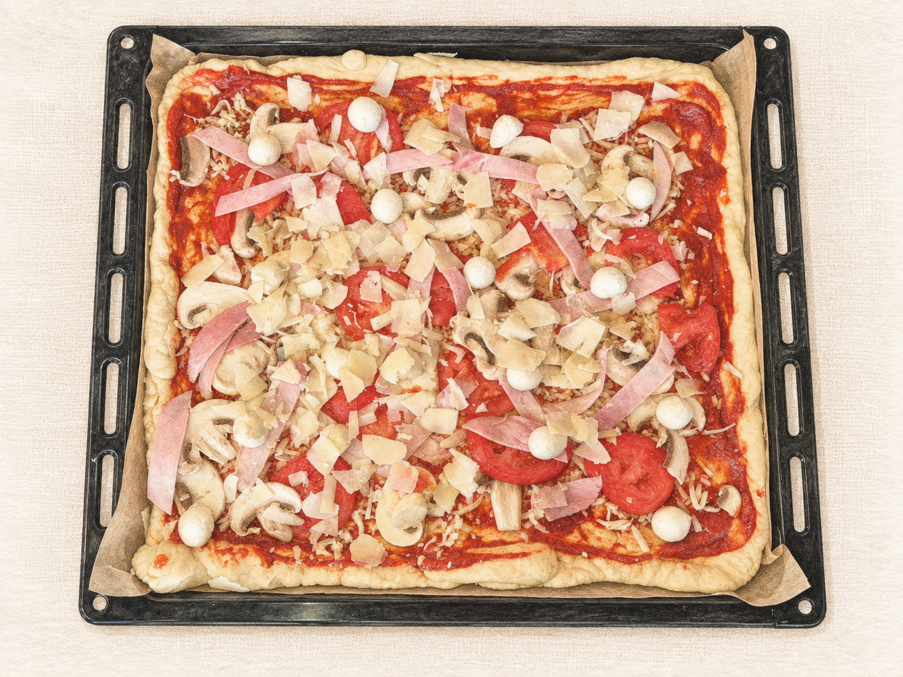
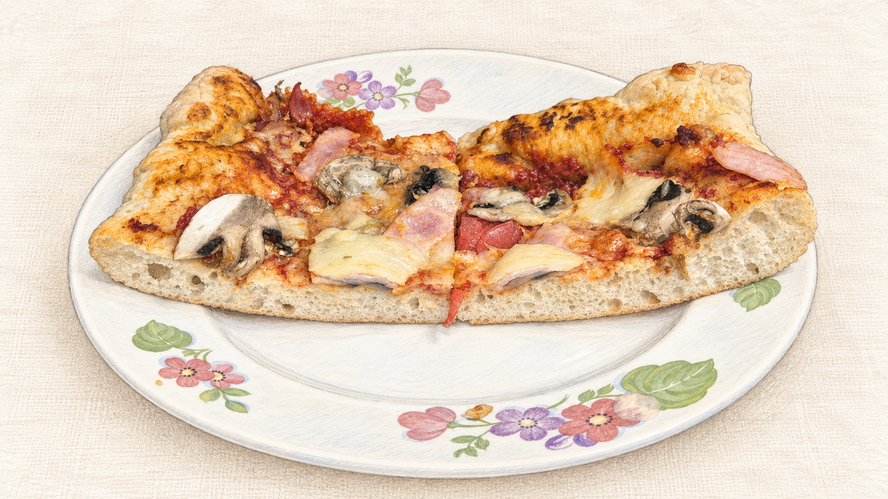

За окном осень, дни становятся короче, вечера длиннее. Что может быть лучше, чем добавить в них немного теплоты и вкуса...

Решил приготовить пиццу. Вспомнил старый рецепт теста из инструкции к хлебопечке, ещё из детства. Хлебопечка давно другая, а рецепт до сих пор помню как стишок: «Вода, мука, соль, сахар, масло, дрожжи».

Очень простой. Один стакан воды, три стакана муки, столовая ложка растительного масла, чайная ложка дрожжей. А сколько соли и сахара — уже не помню. Пришлось немного восстановить рецепт по ходу дела.

## Тесто

В итоге пропорции получились такие:

- вода — 300–310 мл;
- мука — 3 стакана объёмом примерно 300 мл каждый;
- соль — 1 чайная ложка;
- сахар — 1 столовая ложка;
- растительное масло — 1 столовая ложка;
- сухие дрожжи — 1 чайная ложка.

Мерный стакан от хлебопечки потерялся, поэтому воспользовался обычным. Получился на 300 мл. Муку тоже отмерял им, точного веса в граммах не знаю.

Всё загрузил в хлебопечку, программа «Дрожжевое тесто», полтора часа. У меня GARLYN Home BR-1000, это программа №11.

Сначала тесто выглядело грубым, немного суховатым. Но к концу программы хорошо поднялось, стало гладким и мягким.

Пора раскатывать, а скалку найти не могу. Пока искал, попробовал растянуть руками. Потом скалка нашлась, но уже и не нужна — тесто легко тянется само.

Положил на пергамент, растянул от середины к краям, оставил бортики потолще. Получилась почти квадратная основа. Немного дать ей отдохнуть, а пока заняться начинкой.

## Соус и начинка

Для соуса взял обычную томатную пасту, развёл водой до консистенции густого кетчупа, добавил немного растительного масла. Соль и сахар не добавлял.

Распределил по тесту тонким слоем.

С начинкой всё просто, тут были:

- тёртая моцарелла;
- ветчина;
- свежие шампиньоны;
- помидоры;
- мини-моцарелла;
- пармезан.

Сначала тёртая моцарелла, потом ветчина, грибы и помидоры. Сверху мини-моцарелла, в завершение посыпать пармезаном.

Всё на глаз. С грибами и помидорами старался не переборщить, чтобы не получилось слишком мокро. Забегая вперёд — можно было быть немного щедрее.

## Печём

Духовка, верх и низ, без конвекции. Пиццу поставил немного ниже середины. Температура примерно 230–250 °C, по времени около 15–18 минут.

Первые десять минут не открывал. Потом посмотрел — бортики ещё светлые, пусть постоит немного дольше. Подрумянились, сыр расплавился, грибы приготовились. Проверил низ — пропёкся. Достаём.

Тесто получилось пышное и мягкое, в середине примерно сантиметр-полтора, бортики толще. В разрезе небольшие равномерные поры.

В целом пицца получилась неплохая, но местами недостаточно сочная. Начинки всё же нужно чуть больше. В следующий раз добавлю ветчины, грибов и сыра, возможно, немного соуса. И обязательно смесь трав — орегано, базилик, чуть-чуть тимьяна.

А тесто оставлю таким же. Хорошее получилось.
