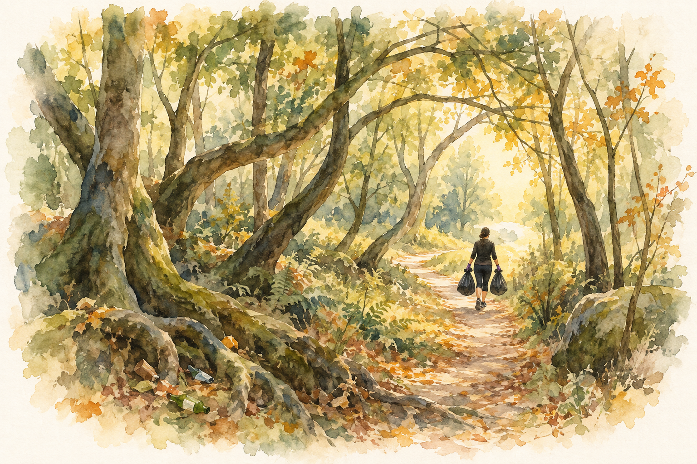
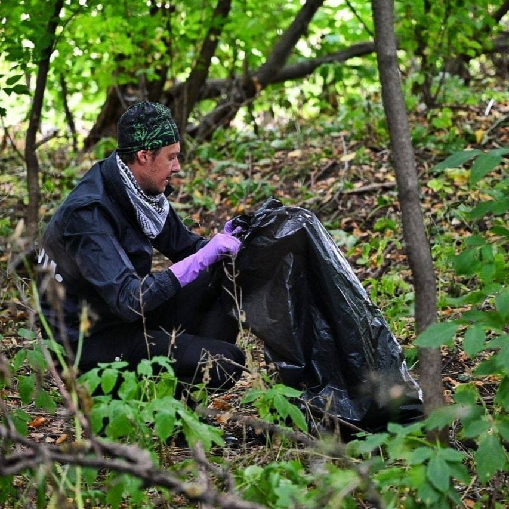
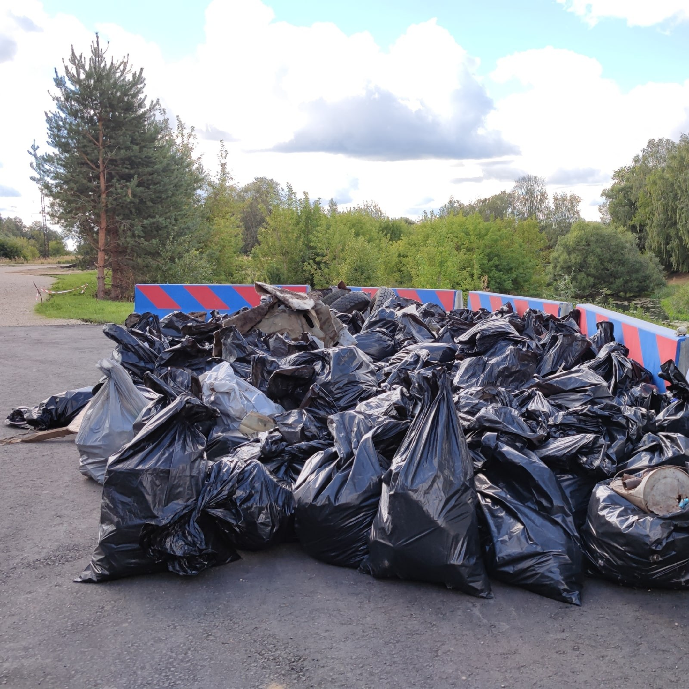

<!--
Редакторские заметки:
- Короткая заметка сохранена без расширения и подзаголовков. Только три орфографические правки.
- forest-path-v3.png — утверждённая акварель «Распутать лес»: тропа, переплетённые деревья и бегун с двумя мешками. Без лешего и щипцов; принята автором к публикации 21.09.2026.
- Проверить итоговый вес собранного мусора и название мероприятия.
- Две фотографии в тексте: процесс и мешки; два дополнительных кадра в карусели в конце, без повторов.
- Карта не добавлена: автор описывает короткий выход около 200 м туда и обратно, координаты не выдумывать.

Исходные записи VK:
- https://vk.ru/wall44829586_595

Вложения исходной записи (оригиналы сохранены в media-sources/vk/plogging/):
- https://vk.ru/photo44829586_457239403
- https://vk.ru/photo44829586_457239404
- https://vk.ru/photo44829586_457239405
- https://vk.ru/photo44829586_457239406
-->

3 сентября 2022

Что же такое плоггинг? Бывают различные многоборья, когда совмещаются различные, порой удивительно непохожие активности внутри одного соревнования. Это и биатлоны, и дуатлоны, и триатлоны, и полиатлоны. Порой активности чередуются, порой идут параллельно. Можно ли назвать плоггинг дуатлоном? Да, пожалуй, там нужно бежать и убирать. Но убирать же не атомарное действие. И приседать, и наклоняться, и тяжести переносить. В общем, по всем параметрам гонка с препятствиями.

Забег-субботник. Время на прохождение 1 час, дистанция до 8 километров. За отведенное время удалось собрать два мешка битого стекла и какой-то пластиковой мелочевки. Много бегать не посчастливилось, ~200 метров от старта до рощицы, и столько же обратно. Утверждается, что этой 400-метровкой побили рекорд по самой короткой дистанции на RHR Plogging.

Собрали чуть больше тонны мусора, но кажется что там можно проводить такие субботники каждую неделю на протяжении года, и всё равно останется что прибрать. Трасса чудовищно загрязненная. Просто не укладывается в голове, как может образоваться мусор, тем более такой разнообразный, и в таких количествах в лесочке.

Бежать и убирать.


