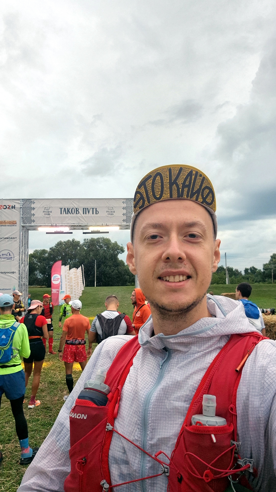

<!--
Редакторские заметки:
- Первый кандидат на совместную редактуру и следующую публикацию.
- Две фотографии добавлены в page bundle; проверить финальный порядок и подписи.
- Проверить, нужен ли читателю короткий контекст про ITRA 4 и «квалу на Вальгаллу».
- Решить, оставлять ли рекламный призыв в финале или закончить личным впечатлением.

Исходные записи VK:
- https://vk.ru/wall44829586_627

Вложения из исходных записей (скачать оригиналы отдельно):
- https://vk.ru/photo44829586_457239983
- https://vk.ru/photo44829586_457239984
-->

111 км, 13:32:30

Август. Ивановская область. Гаврилов Посад.
Всего 30 км от столицы трейлранинга.

Я по полю-полю...
С небом за спиною...

Подыскивал соточку на ITRA 4 для квалы на Вальгаллу. Нашёл забег в Гавриловом Посаде. Сперва отнёсся скептически, в прошлом году было что-то около 20 участников. Но зарегистрировался.

## Перед стартом

Приехал в субботу, дикарём. Спать в машине.

Сразу трогает душу пасторальный антураж экспо — стоги сена, прогулки на лошадях. Экспо достаточно наполненное. И для детей есть развлечения, аквагрим, батуты, разные мастер-классы. Купил дочке кокошник "Русская тропа" и значки. Мерч и айдентика у забега на высоком уровне, красивейшая. Очень круто. Получил стартовый пакет. Интересный, очень наполненный, особенно понравилось участие местных производителей Гаврилово-Посадского хлебокомбината и ОдинМёд.
Концерт. Файершоу. Восторг.

Воскресенье. 5 утра. Старт.

Перед стартом была некоторая дезорганизация — непонятно, что с проверкой экипировки и сдачей заброски (в стартовом не было наклейки с номером). Волонтёры не знали, кто и где проверяет экипировку.

## В поля

Присели на дорожку и побежали. Кружочек по городу, и вперёд в поля.

С погодой повезло. Утром было совсем прохладно, даже надел ветровку. Потом стало теплее, снял. Но всё равно переменная облачность, ветер, иногда дождь — было хорошо, комфортно, без жары.

В первой части дистанции много бродов, большей частью чистые.
ППшек ооочень много, расположены на расстоянии 8–12 км, единственный длинный перегон 25 км перед заброской.

Разметка хорошая, трек точный, по часам вышло 112,5, при заявленных 111, но за счёт того, что махнул поворот и пришлось возвращаться. Только два раза были вопросы к разметке на 23 км (берёзовая роща) и 32 км (резкий поворот с дороги).



Природа невероятная, поля-поля-поля-луга-поля-капелька леса-поля. Я таких полей никогда в жизни не видел, даже не мог вообразить что бывает такой простор — сколько видно от края до края горизонта всё поля. Выглядит в точности как "безмятежность" Windows XP. Практически отсутствуют ветрозащитные лесополосы. И деревьев мало. Всё поля.
Трасса беговая, даже беговущая — установил личник на сотке, на 30 минут быстрее моего лучшего времени на Груте, и на час быстрее чем Грут в этом году.
Дороги по полям — фантастические, плавные подъёмы и спуски, словно летишь.
Орги говорили, что трек проходит через две самые высокие точки Ивановской области и что обзор до горизонта составляет более 25 км.

Очень впечатлило за пару км перед заброской — васильковое поле ржи. Причём такое густое и синее, что вдали кажется морем.

Из сложного — были участки сорных лугов, поля крапивы и борщевика, но куда же без них? Трудно бежать, потому что трава хватает и обвивает ноги, словно щупальца.
Немного было мест с неровной землёй, где восхитительно прорабатываешь стопы :).

ПП5 Дубёнки — волонтёрили бабушки и дедушки, спросили, откуда я родом, и спели "Севастопольский вальс" ❤.

## Заброска

Заброска хлебосольная, такой радушный приём, волонтёры-девчонки бегут навстречу, машут, обнимаются. Бульончиком угощают, еды на любой выбор. Эх, даже жаль уходить.

После заброски путь был сложнее. Небо прояснилось и пришла жара. Маневрировал на грани теплового удара. Охлаждал кепку в лужах. Вот где не хватает бродов — между 80-м и 100-м километрами было бы хорошо добавить брод для охлаждения.

## К финишу

Особая благодарность за то, что перед самым финишем два чистых брода, окунаешься и приходишь свеженьким, чистеньким. Именно то, чего не хватает на Груте.

Так что Русская тропа в Гавриловом Посаде — это восходящая заря трейла. Удивительно приятный и душевный забег. Обязательно приедем в следующем году всей семьёй.

## Пожелания организаторам

И немного пожеланий организаторам:

- наклейки с номером для заброски и камеры хранения;
- между 80-м и 100-м километрами жизненно нужен брод. Ну или хотя бы провести трек рядом с водоёмом, как на Песчанке GRUT, чтобы можно было сойти с тропы, окунуться и охладиться;
- хорошо бы продлить экспо, хотя бы фудкорт, на второй день. Болельщикам может быть скучно ждать;
- на номере рядом с отсечками ПП добавить финиш и его кат-офф. Последняя точка на 104-м километре вводила в заблуждение: впереди ещё около семи километров или уже нет?
- там же отметить колодцы, ручьи и пункты освежения, как на номере «Дороги через Лавру»;
- и ещё добавить в продажу маскота — игрушечную лошадку. Деревянную или вязаную.

А если вы ещё не бегали Русскую тропу — то регистрируйтесь, и не пожалеете. Таков путь!
